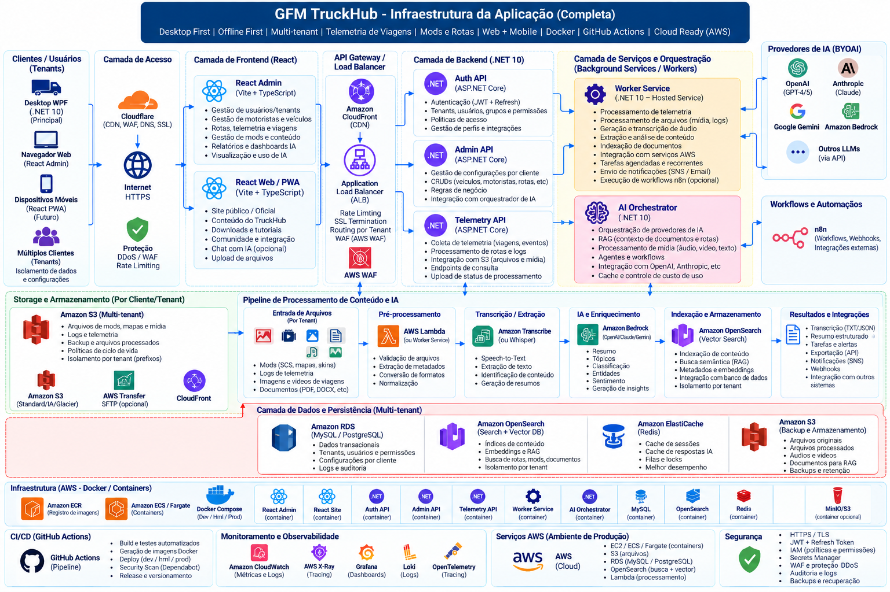

# GFM TruckHub

Hub desktop para **Euro Truck Simulator 2 (ETS2)** e **American Truck Simulator (ATS)**, desenvolvido em .NET 10/WPF e orientado por tasks. A ideia de negócio original é preservada; a estrutura foi preparada para evolução arquitetural seguindo **Local/Offline First → Container Ready → Cloud Ready → AWS Target**.

## Capacidades

Desktop UI First com mocks; detecção/configuração dos jogos; Map Extractor; Graph/Routing e rotas multi-stop; Telemetry; Live Assistant; n8n; Crazy Traffic e futuras capacidades aprovadas nas tasks.

## Como começar

1. Leia `prompts.md`.
2. Leia `PROJECT-STATE.md`, `PROJECT_STRUCTURE.md` e `CLAUDE.md`.
3. Execute `/current`.
4. Trabalhe apenas na task apontada por `tasks/CURRENT.md`.
5. Rode os Quality Gates e gere o relatório.
6. **STOP** ao concluir a task.

## Estrutura

- `backend/` — Domain/Application/Infrastructure e futuras APIs/workers quando justificadas.
- `frontend/` e `mobile/` — reservados; não implementar sem aprovação.
- `tests/` — unitários, integração, arquitetura e E2E.
- `infrastructure/` — AWS, Docker, observabilidade e OpenTofu.
- `deploy/` — artefatos de implantação.
- `.claude/` — agentes, skills, rules e commands existentes.
- `tasks/` — roadmap/task workflow existente.
- `data/mock/` — dados mock preservados.
- `docs/` — arquitetura, desenhos, relatórios e catálogo de telas.

## AWS

AWS é alvo cloud, não dependência do Desktop. Consulte `infrastructure/aws/README.md`. Serviços previstos incluem S3, SQS/SNS, Lambda, ECS/Fargate, ECR, RDS, ElastiCache, Secrets Manager, IAM e CloudWatch, adotados somente quando houver necessidade real.

## Arquitetura e desenhos

Arquivos-fonte oficiais: `docs/architecture/drawio/*.drawio`. Exportações devem ficar em `docs/architecture/exports/`. Diagramas precisam identificar o que é IMPLEMENTED, PLANNED, OPTIONAL, LOCAL ONLY e AWS ONLY.

## Referências visuais

As imagens pesadas permanecem fora do ZIP. Raiz canônica:

`D:\Empresa\GFMaurila\projetos\gfm-truckhub-claude-code-zip\references\screens`

O índice continua em `docs/screens/SCREEN-CATALOG.md`.

## Segurança operacional

Instalações, perfis, mods e arquivos ATS/ETS2 são read-only por padrão. Nunca gravar secrets no repositório e nunca declarar infraestrutura planejada como implementada.

## 🤖 Bootstrap de IA / Agents

A geração dos Agents e Skills começa obrigatoriamente pelo pacote local:

`D:\Empresa\GFMaurila\projetos\gfm-truckhub-claude-code\references\Kit-IA-Dev.zip`

Leia `prompts.md` e `docs/agents/AGENTS-BOOTSTRAP-KIT-IA-DEV.md` antes de executar a automação do projeto.

## ☁️ Desenho da infraestrutura AWS

O desenho editável da infraestrutura está em `docs/architecture/GFM-TruckHub-AWS-Infrastructure.drawio` e sua descrição em `docs/architecture/AWS-INFRASTRUCTURE.md`.

------------------------------------------------------------------------

## 🧑‍💻 Autores

-   **Guilherme Figueiras Maurila**

------------------------------------------------------------------------

## 📫 Como me encontrar

